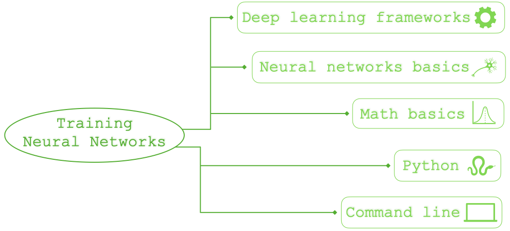

# Getting Started with Neural Networks

This guide is for anyone who wants to learn how to use neural networks but has little to no prior experience and does not know where to start. We will cover basic concepts, as well as programming tools, that will help you to get started. You can find this guide useful if you are a math student, a life scientist or anyone else interested in data analysis. 

The guide is organized into sections as in the map above and you can read it in the order that is most convenient for you, as well as skip some sections altogether if you are familiar with concepts covered in them. Here is some advice on how to navigate the guide:

* If you don't know what a neural network is, we recommend you to first read [Section 1](#math_background) and [Section 2](#nn_basics). These sections provide some resources to understand the basic math and ideas behind neural networks training. 

* Before diving into the next sections, which discuss the necessary tools for training neural networks, we recommend to visit the [Tensorflow Playground](https://playground.tensorflow.org/#activation=tanh&batchSize=10&dataset=circle&regDataset=reg-plane&learningRate=0.03&regularizationRate=0&noise=0&networkShape=4,2&seed=0.40188&showTestData=false&discretize=false&percTrainData=50&x=true&y=true&xTimesY=false&xSquared=false&ySquared=false&cosX=false&sinX=false&cosY=false&sinY=false&collectStats=false&problem=classification&initZero=false&hideText=false). There you can immediately start tinkering with neural nets in an interactive fashion without programming. The [Tensorflow Playground](https://playground.tensorflow.org/#activation=tanh&batchSize=10&dataset=circle&regDataset=reg-plane&learningRate=0.03&regularizationRate=0&noise=0&networkShape=4,2&seed=0.40188&showTestData=false&discretize=false&percTrainData=50&x=true&y=true&xTimesY=false&xSquared=false&ySquared=false&cosX=false&sinX=false&cosY=false&sinY=false&collectStats=false&problem=classification&initZero=false&hideText=false) may at first overwhelm you with neural network training options that don't make much sense to you yet. In [Section 6](#train_nns) we will provide various resources for you to understand these options and many tips and tricks that go into successfully training a neural network. But first you can just
click play on the top left corner in the playground and watch what happens! 

* Training neural nets yourself for applications or research requires some programming, most often in Python. If you don't have any programming background and are not familiar with Python you should learn a bit of it in order to train your first neural networks. We talk about Python in [Section 5](#python) of the guide. You will also need some basic command line skills once you start moving on from tutorials to your own projects (for example to manage conda or pip environments and ssh connections to remote servers). We talk about command line resources in [Section 3](#cl_basics). In [Section 4](#hard_os) we also touch on hardware and OS in the context of training neural networks. 

* Once you are familiar with the basics of Python and some command line, you are ready to dive into neural network training. Fortunately there are very powerful open source tools (Python libraries) that make training neural networks easier than ever. These tools are also known as deep learning frameworks. The most popular ones are [Tensorflow](https://www.tensorflow.org) and [PyTorch](https://pytorch.org), which we briefly discuss in [Section 6](#dl_frameworks). We recommend you check out this [simple colab notebook tutorial](https://colab.research.google.com/github/tensorflow/docs/blob/master/site/en/tutorials/keras/classification.ipynb) that walks you through an image classification task with neural networks in Tensorflow. Colab notebooks are the perfect way to start for beginners with a basic understanding of neural networks and rudimentary python skills. Google describes Colab as follows:
> Colaboratory, or “Colab” for short, is a product from Google Research. Colab allows anybody to write and execute arbitrary python code through the browser, and is especially well suited to machine learning, data analysis and education. More technically, Colab is a hosted Jupyter notebook service that requires no setup to use, while providing free access to computing resources including GPUs.

* After choosing your preferred deep learning framework, you are ready to explore the tricks involved in training neural networks successfully. You can find more on this in [Section 7](#train_nns). 

* If you are getting started with research in deep learning, you may particularly benefit from [Section 8](#resexp_nns), where we give tips and resources for research experiments with neural nets. 

* [Section 9](#data_an) touches on basic tools for data analysis, which are often handy in neural network experiments and applications. 

* Finally, in [Section 10](#dl_courses) we link some well-known online courses that teach deep learning.

Enjoy!

# Table of Contents 
1. [Math Background](#math_background) 
2. [Neural Network Basics](#nns_basics)
3. [Command Line Basics](#cl_basics)
4. [Hardware and OS](#hard_os)
5. [Python](#python)
6. [Deep Learning Frameworks](#dl_frameworks)
7. [Training Neural Nets](#train_nns)
8. [Research Experiments with neural nets](#resexp_nns)
9. [Data Analysis](#data_an)
10. [Deep Learning Courses Online](#dl_courses)
11. [Contact](#contact)

## 1. Math Background 
[Back to table of contents](#table_content)

Areas of math that are most commonly used in neural networks are (more or less in the order of importance):

* **Linear Algebra** (vectors, matrices and various operatins with them)
* **Calculus** (gradients and integrals)
* **Probability and Statistics** (random variables, expectations, variance, Bayes' theorem)
* **Optimization Algorithms** (minimization or maximization)
 
If you are familiar with basics of these fields, especially with matrices and gradients (e.g. you took Linear Algebra and Multivariable Calculus courses), you can skip this section. Otherwise we recommend that you obtain basic understanding of matrices and gradients. 

You can start with videos by [3blue1brown](https://www.3blue1brown.com), who created a series on the basics of linear algebra, calculus and multivariable calculus. You can either watch the entire series or just stop watching after feeling comfortable with matrices and gradients. 

* [Linear Algebra Series](https://www.youtube.com/playlist?list=PLZHQObOWTQDPD3MizzM2xVFitgF8hE_ab)
* [Calculus Series](https://www.youtube.com/playlist?list=PLZHQObOWTQDMsr9K-rj53DwVRMYO3t5Yr)
* [Multivariable Calculus Series](https://www.youtube.com/watch?v=TrcCbdWwCBc&list=PLSQl0a2vh4HC5feHa6Rc5c0wbRTx56nF7)

You can also have a look at the following free online courses from [Khan academy](https://www.khanacademy.org):

* [Linear Algebra](https://www.khanacademy.org/math/linear-algebra)
* [Multivariable Calculus](https://www.khanacademy.org/math/multivariable-calculus)
* [Statistics and Probability](https://www.khanacademy.org/math/statistics-probability)

If you prefer written or more in-depth sources, you can have a look at the following:

* [_Linear Algebra Review and Reference_ by Zico Kolter (updated by Chuong Do)](http://cs229.stanford.edu/section/cs229-linalg.pdf)
* [_Introduction to Linear Algebra_ by Gilbert Strang](http://math.mit.edu/~gs/linearalgebra/)
* [_Review of Probability Theory_ by Arian Maleki and Tom Do](http://cs229.stanford.edu/section/cs229-prob.pdf)

 If you are a Mathematician you may now think the math in deep learning is not very involved, but this is far from too. Take a look at the [Modern Mathematics of Deep Learning](https://arxiv.org/pdf/2105.04026.pdf) paper, which is a great introduction into the exciiting and growing field of Mathematics of Deep Learning.
 
For the next section you should understand why the gradient is pointing in the direction of steepest descent and  matrix multiplication.

## 2. Neural Network Basics 
You can skip this section if you already know what a neural network is, what a loss function and the backpropagation algroithm is. Before traininig neural networks you should know what a neural network is. The following video series by [3blue1brown](https://www.3blue1brown.com) provides an excellent intuitive introduction to the basics of neural networks.

[https://www.youtube.com/playlist?list=PLZHQObOWTQDNU6R1_67000Dx_ZCJB-3pi](https://www.youtube.com/playlist?list=PLZHQObOWTQDNU6R1_67000Dx_ZCJB-3pi)

## 3. Command Line Basics
To run code on your computer or work with remote machines, you often need to use command line. The command languages (or shells) that are available for you depend on your OS. The most commonly used one is Bash, which is the default for most Linux systems and MacOS prior to 2019. You can start learning about it with this tutorial: [https://ubuntu.com/tutorials/command-line-for-beginners#1-overview](https://ubuntu.com/tutorials/command-line-for-beginners#1-overview)

Other common shells for Linux or MacOS (e.g. [Zsh](https://en.wikipedia.org/wiki/Z_shell)) are quite similar to Bash and allow easy transition.

On the other hand, Windows uses Command Prompt (cmd), which is rather different from Bash. You can take a look at this tutorial if you have interest on learning cmd: [https://www.cs.princeton.edu/courses/archive/spr05/cos126/cmd-prompt.html](https://www.cs.princeton.edu/courses/archive/spr05/cos126/cmd-prompt.html)

## 4. Hardware and OS

The training of neural networks is usually computationally expensive. Modern deep learning frameworks have included the possibility to train the neural network in different architectures and devices, in particular, GPUs. Although the need of a GPU is generally minor when you are training your first experiments, a real-world application will sometimes need more than one GPU to be trained. The advantages of frameworks like [pytorch or tensorflow](#dl_framewokrs) is the compatibility of its code to almost any device. Since the software normally used in deep learning is python, one can train neural networks on any operating system, e.g. Windows, OS X and Linux. We recommend to use Windows or Linux since currently OS X does not offer a stable GPU version. 

In order to use GPUs for training you need to have a CUDA-compatible GPU from NVIDIA. If you have Linux Ubuntu, you can follow this [post](https://askubuntu.com/questions/1288672/how-do-you-install-cuda-11-on-ubuntu-20-10-and-verify-the-installation). For Windows 10 users, you can consult this [guide](https://towardsdatascience.com/installing-tensorflow-with-cuda-cudnn-and-gpu-support-on-windows-10-60693e46e781). 

If you are affiliated to a university or a research center you would normally have access to computing clusters with GPUs. The main tool you need to know to run your training remotely is [ssh](https://www.hostinger.com/tutorials/ssh-tutorial-how-does-ssh-work). If you are interested to have your own Deep Learning Rig, there are affordable ways to build it; this [video](https://www.youtube.com/watch?v=Nz7xzUybpFM&ab_channel=DanielBourke) provides a detailed guide on how to do it. There are also some commercially available pre-built deep learning workstations (high-performance PCs), for example in Germany, there is [AIME](https://www.aime.info/).

## 5. Python
Python is a very popular programming language! It is fair to say that most of deep learning research and applications require python. The following chart illustrates the rise of popularity of python.

(Source: https://stackoverflow.blog/2017/09/06/incredible-growth-python/ )

There is an abundance of tutorials for python. We recommend 
[https://www.python-course.eu/python3_course.php](https://www.python-course.eu/python3_course.php)

 The main advantage of python is the available optimized libraries for scientific computing, for example, [numpy](https://numpy.org/doc/stable/) and [scipy](https://docs.scipy.org/doc/scipy/reference/). For visualiation [matplotlib](https://matplotlib.org/stable/contents.html) is typically used. We recommend anybody to create a local enviroment to install all your libraries wihtout affecting the global system. This can be done using [conda](https://docs.conda.io/projects/conda/en/latest/user-guide/index.html), conda is also useful to install GPU-capable libraries. Within conda you can use [pip](https://www.anaconda.com/blog/using-pip-in-a-conda-environment) for easy installation of the libraries. 

In scientific computing, you typically would also like to interact with the results of your computations and visualize them in real-time. [Jupyter Notebook](https://jupyter.org/documentation) is the best tool to do that in Python. It allows you to visualize and run individual pieces in real-time, which is ideal for prototyping. Jupyter Notebook is also available for remote computation, one can learn to run notebooks remotely following this [guide](https://fizzylogic.nl/2017/11/06/edit-jupyter-notebooks-over-ssh/). This also allows you to have a graphical interface on remote servers. Another great visualiation tool similar to Jupyter is [Colab](https://colab.research.google.com/notebooks/intro.ipynb#recent=true). As Jupyter, in Colab you can use interactive notebooks to run python code and train neural networks. The big advantage of this tool is that it makes all the computations in the cloud. This also means that you can run your notebook whenever you have internet access. Google also allows Colab users to train and deploy models, both freely and with cost, with GPUs and TPUs. 

## 6. Deep Learning Frameworks 
There is a great number of python libraries that provide implementations of neural networks, but the most popular ones are Tensorflow and PyTorch:

* [PyTorch](https://pytorch.org/tutorials/beginner/basics/intro.html)
* [Tensorflow](https://www.tensorflow.org/tutorials) (with its user-friendly [Keras](https://keras.io/about/) API)

Both of the libraries allow similar functionality and are well-documented. They are also compatible with a lot of architectures, such as CPU, GPU and TPU. The choice between them either depends on your project's needs or is just subjective. You can consult some _recent_ blogposts (e.g. [this one](https://medium.com/featurepreneur/tensorflow-vs-pytorch-which-is-better-for-your-application-development-6897d5d4dee0)) to make your choice.

## 7. Training Neural Nets 
There are a lot of code examples online, which run the entire pipeline of building and training neural network models. Check out for example these colab notebooks, which you can simply run with no changes to train a neural network on a given dataset:

 * [Basic classification: Classify images of clothing](https://colab.research.google.com/github/tensorflow/docs/blob/master/site/en/tutorials/keras/classification.ipynb#scrollTo=jYysdyb-CaWM)
 * [Text Classification with Movie Reviews](https://colab.research.google.com/github/tensorflow/hub/blob/master/examples/colab/tf2_text_classification.ipynb#scrollTo=ItXfxkxvosLH)
 * [Timeseries forecasting for weather prediction](https://colab.research.google.com/github/keras-team/keras-io/blob/master/examples/timeseries/ipynb/timeseries_weather_forecasting.ipynb)

The models above are specifically designed and tuned to solve a particular problem, which may be different from the application you are interested in. To find a model that is well-suited for your problem, it is always useful to look for more examples online. You can find a great variety of short and simple code examples for different data types (images, video, audio, timeseries, etc.) and different problems (classification, object recognition, denoising, generation, etc.) in the [Keras library of code examples](https://keras.io/examples/). Learning what models are popular in your domain will help you get an idea of what is likely and not likely to work for you. You can even look up some pre-trained models (see e.g. [TensorFlow Hub](https://tfhub.dev)) that are already trained on large datasets specific to a particular domain and are ready to apply without training. 

However, you may still need to design your own model from scratch, e.g. because your problem is very specific, or you need more control and understanding of the results. In this case, there are numerous choices you have to make while building and training a neural network model. They can be categorized as follows:

**Architecture:** First you need to choose the very structure of a network. How many layers should it have? What kind of layers in what order? How many neurons/filters should be in each layer? The number of particular architectures published in deep learning research is enormous and it's impossible to cover all of them. But to understand more complex architectures, it is important to consider at least these basic classes:
 * [Fully-connected networks](https://www.oreilly.com/library/view/tensorflow-for-deep/9781491980446/ch04.html): 1D signals or feature classification. 
 * [Convolutional networks](https://towardsdatascience.com/a-comprehensive-guide-to-convolutional-neural-networks-the-eli5-way-3bd2b1164a53): 2D signals, and images.
 * [Recurrent networks](https://colah.github.io/posts/2015-08-Understanding-LSTMs/): Time series and natural language. 
 * [Residual networks](https://towardsdatascience.com/introduction-to-resnets-c0a830a288a4): Operator learning and images.
 * [Transformers](https://theaisummer.com/transformer/): Time series, natural language, and images. 

**Optimization method:** There is a number of optimization methods beyond gradient descent that are commonly used in deep learning and you need to choose one of them to train your network. You can find a good survey of optimization methods for deep learning in this [blogpost](https://medium.com/analytics-vidhya/different-optimization-algorithm-for-deep-neural-networks-complete-guide-7f3e49eb7d42). Often adaptive optimization methods or methods with momentum yield better results than simple gradient descent and the Adam algorithm is a very popular choice.

**Hyperparameters:** You need to understand and reasonably choose hyperparameters involved in training, such as learning rate, batch size or number of training epochs. To undertand what hyperparameters are in general and what kinds of hyperparameters you will encounter during training of neural networks, you can check this [blogpost](https://towardsdatascience.com/neural-networks-parameters-hyperparameters-and-optimization-strategies-3f0842fac0a5). The choice (or tunning) of hyperparameters can also be performed algorithmically in practice. This [post](https://neptune.ai/blog/hyperparameter-tuning-in-python-a-complete-guide-2020) is an up-to-date study of available hyperparameter tunning algorithms and implementations. 

**Initialization:** Initialization of your weight can make the difference for your network to converge succesfully to good minima. In this [article](https://www.deeplearning.ai/ai-notes/initialization/) there is a detailed discussion on the commonly used initialization procedures. 

**Layers:** A neural network architecture is defined by its basic components, the layers. The most commonly used layers are for example:
  * [Dense layer](https://medium.com/datathings/dense-layers-explained-in-a-simple-way-62fe1db0ed75)
  * [Convolution layers](https://machinelearningmastery.com/convolutional-layers-for-deep-learning-neural-networks/)
  * [Pooling layer](https://machinelearningmastery.com/pooling-layers-for-convolutional-neural-networks/)
  * [Batch Norm layer](https://www.youtube.com/watch?v=nUUqwaxLnWs)
  * [Recurrent layers](https://medium.com/datathings/recurrent-lstm-layers-explained-in-a-simple-way-d615ebcac450)
  * [Residual layers](https://medium.com/analytics-vidhya/understanding-and-implementation-of-residual-networks-resnets-b80f9a507b9c)
  * [Attention layers](https://lilianweng.github.io/lil-log/2018/06/24/attention-attention.html)

These layers and many variations of them are implemented in the deep learning frameworks that we covered.

## 8. Research Experiments with Neural Nets

Deep learning is a field that has an important empirical side. In order to train a neural network succesfully merely choosing the design is not enough, you would need to make trial-error iterations in order to tune the different elements. You can evaluate the performance of your neural network using different metrics, such as accuracy and mean square error. Software like [tensorboard](https://www.tensorflow.org/tensorboard) allows you to monitor the performance of different runs simultaneously. Tools like [Keras Tuner](https://www.tensorflow.org/tutorials/keras/keras_tuner) in tensorflow and [Ray Tune](https://pytorch.org/tutorials/beginner/hyperparameter_tuning_tutorial.html) in pytorch are handy for optimization and fine-tunning of different hyperparameters of your architecture. 

## 9. Data Analysis and Image Processing 

Data Analysis and Image processing tools are also very handy in the training of neural networks. In python the main library used for data processing and analysis is [pandas](https://pandas.pydata.org/docs/), inspired by the statistical programming language [R](https://www.r-project.org/about.html). For image processing we recommend the library [sci-kit image](https://scikit-image.org/docs/stable/) which contains plenty of image filtering, resizing, cropping, rotating, etc... algorithms.

## 10. Deep Learning Courses Online 

Much work has gone into several online deep learning courses. We recommend to check out the following two sites:

* [https://www.deeplearning.ai/programs/](https://www.deeplearning.ai/programs/)
* [https://www.fast.ai](https://www.fast.ai)

## Contact 

If you have comments, questions or cool ideas regarding the content of this webpage please feel free to contact the authors:

* [Mariia Seleznova](https://www.ai.math.uni-muenchen.de/members/phd_students/seleznova/index.html): [seleznova@math.lmu.de](mailto:seleznova@math.lmu.de)
* [Stefan Kolek](https://www.ai.math.uni-muenchen.de/members/phd_students/kolek/index.html): [kolek@math.lmu.de](mailto:kolek@math.lmu.de)
* [Hector Andrade](https://www.ai.math.uni-muenchen.de/members/phd_students/andrade/index.html): [andrade@math.lmu.de](mailto:andrade@math.lmu.de)
